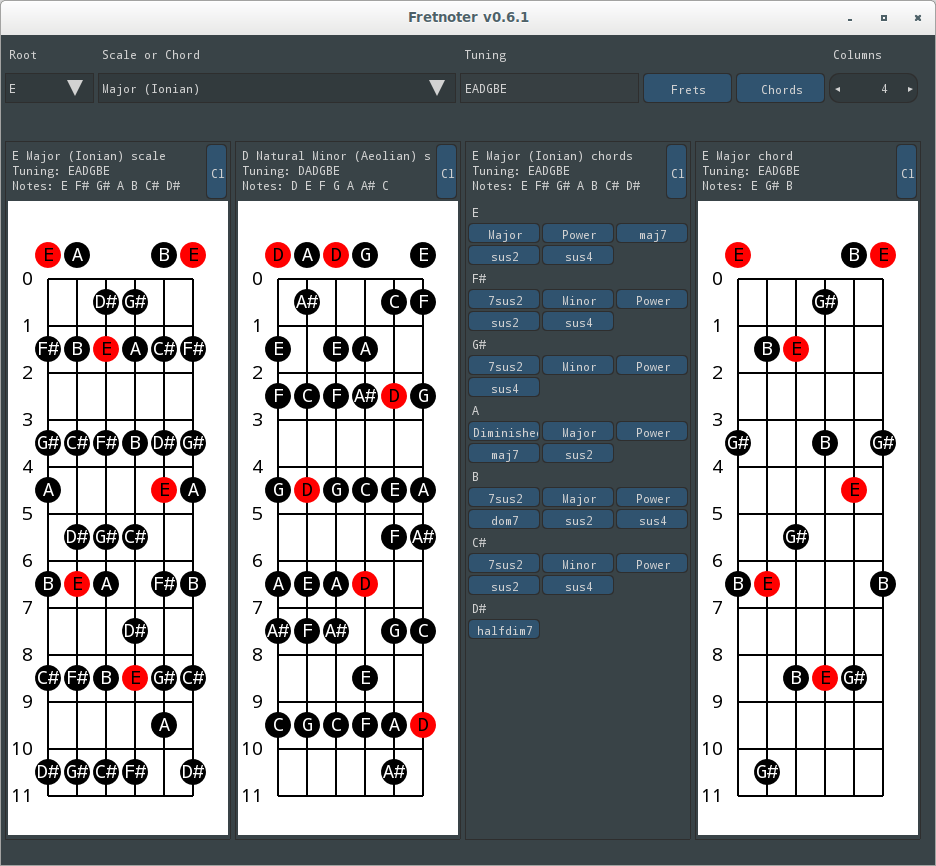

# Fretnoter

Gui application to discover scales and chords of stringed instruments.



## Installation

```
$ go get github.com/kopoli/fretnoter
```

Pre-built binaries for Linux and Windows are available in the releases page.

## Usage

Start the binary from the command line or doubleclick the binary.

No command line options.

Saves the configuration file to XDG user specific directory. E.g.:

Linux: `$HOME/.local/share/fretnoter/config.json`

